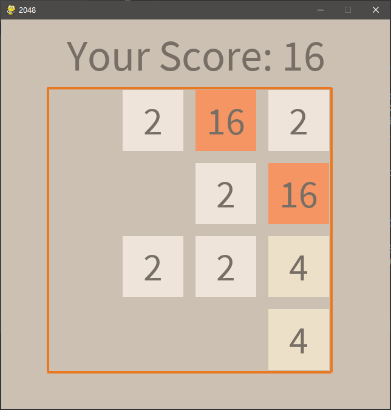
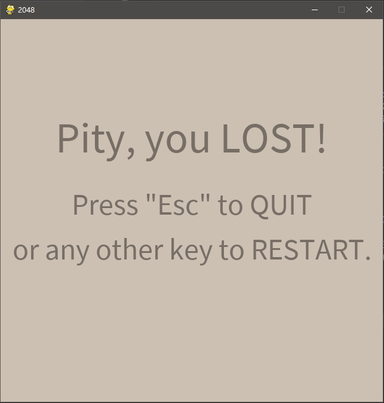

# 2048 Game by Python3 and PyGame

这个项目是对流行游戏 `2048` 的简单模仿，游戏使用 ` Python3 ` 和 `PyGame` 开发。

**目前已经初步完成，但是代码比较 dirty**

## Install

- 下载安装 [`Python3`](https://www.python.org/downloads/) （`Python2` 应该也能运行） 和 [`PyGame`](http://www.pygame.org/download.shtml)。如果你使用的是 64 位系统，可以选择 U.C.Irvine Dr.Christoph Gohlke 编译的 [64bit 版 PyGame](http://www.lfd.uci.edu/~gohlke/pythonlibs/#pygame);
- 在根目录下执行 `python ./2048_main.py`。

## Screen shots

 | 
:---:|:---:
program running | failure screen

*别问我为什么没有 win screen 截图，手残党表示打不到 2048* T_T

## License

- 该项目代码可以随意使用 / 修改，而不必征得本人同意；
- 使用该项目代码时不必附上任何版权 / 作者申明；
- 该软件仅供个人学习游戏开发所用，不得分发，亦不得用于任何包括商业 / 非商业（**包括教育**）行为在内的非个人用途；
- 作者不保证迭代更新 / 修复软件 BUG。

# 2048 Game by Python3 and PyGame (English)

This's a simple clone of popular game `2048` via `Python3` and `PyGame`.

**This project reaches its goal preliminarily, while the code is still kind of *dirty*.**

## Install

- Download and install [`Python3`](https://www.python.org/downloads/) (`Python2` should be fine, too) and [`PyGame`](http://www.pygame.org/download.shtml). If you use 64bit system, you may try the 64bit variant of [`PyGame`](http://www.lfd.uci.edu/~gohlke/pythonlibs/#pygame) complied by Dr.Christoph Gohlke, U.C.Irvine;
- Open you bash / CMD in the root directory and run `python ./2048_main.py`.

## Screen shots

 | 
:---:|:---:
program running | failure screen

*Please don't ask for a screen shot of win screen, I can't reach 2048...* T_T

## License

- You may use / modify this code as your wish without my permission;
- You may use this code without any `copyright` or `copyleft` attached;
- This code's just for individual usage only, distribution or any other non-individual (**include educational**) usage is forbidden;
- Iterative updates or bug fixing are NOT Guaranteed.

Just have fun~
